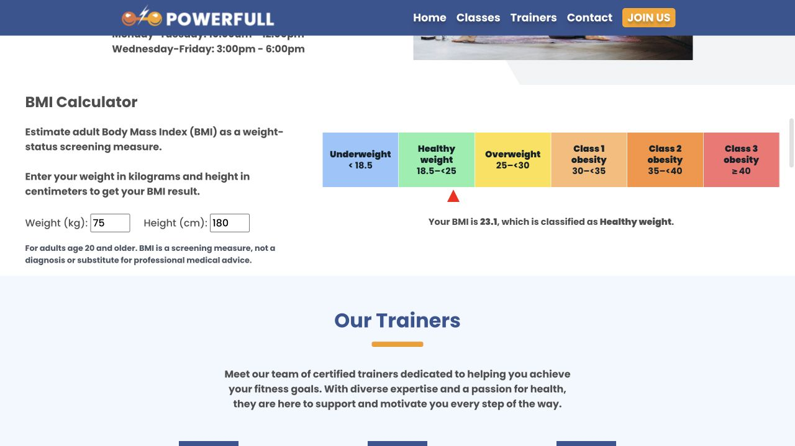

# Sports Center

A responsive sports-center experience rebuilt as a React and Vite application. The page is composed from focused section components, while the adult BMI calculator keeps its calculation and classification rules in a separately tested domain module.

## Demo

[Open the live site](https://sports-center-react.pages.dev/)



## What this project demonstrates

- A multi-section responsive interface assembled from reusable React components for classes, trainers, products, reviews, contact details, and navigation.
- A migration from a static page into a maintainable Vite application with section-level components and scoped styles.
- Domain logic separated from presentation: BMI calculation and adult category boundaries live in `src/bmi.js`, while React components handle input, chart, and result rendering.
- Native keyboard-operable class controls, a named mobile navigation region, and a polite BMI result status.
- A public Cloudflare Pages deployment backed by CI checks for linting, boundary tests, the production build, and a mobile Chromium workflow.

## Verified behavior

The adult BMI calculator uses metric inputs and the current [CDC adult category boundaries](https://www.cdc.gov/bmi/adult-calculator/bmi-categories.html). It distinguishes all three obesity classes and presents BMI as a screening measure for adults age 20 and older—not a diagnosis.

The browser workflow runs the production bundle at a 390×844 mobile viewport. It opens and closes the navigation, switches class content with the keyboard, enters BMI values through focused inputs, verifies the announced result, and rejects horizontal page overflow.

## Run locally

```sh
npm ci
npm test
npm run test:e2e
npm run lint
npm run build
```
