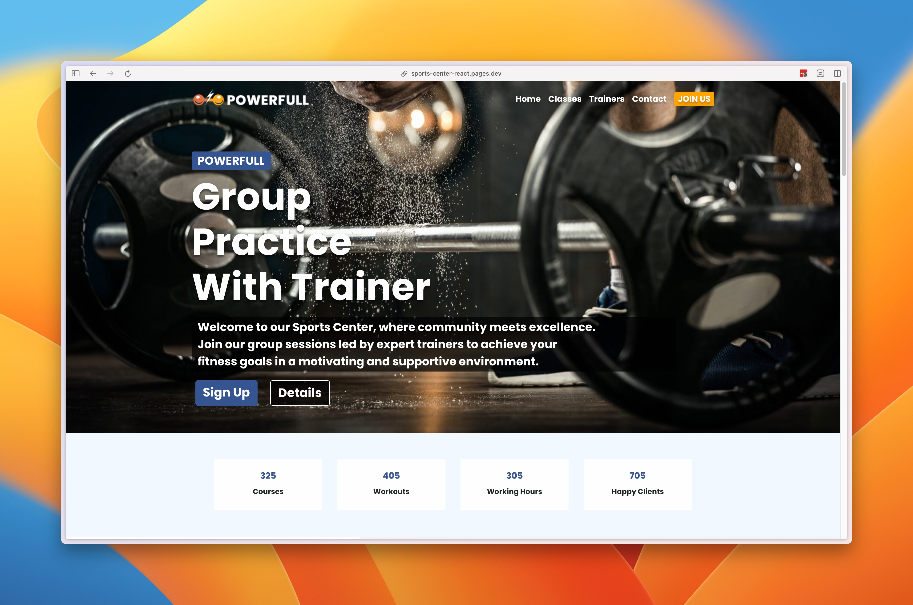

# Sports Center

Welcome to the **Sports Center** demo project! This project is a responsive website for a sports center.

## Demo

Check out the [live version:](https://sports-center-react.pages.dev/)


## Verified behavior

The adult BMI calculator uses metric inputs and the current [CDC adult category boundaries](https://www.cdc.gov/bmi/adult-calculator/bmi-categories.html). It distinguishes all three obesity classes and presents BMI as a screening measure for adults age 20 and older—not a diagnosis.

```sh
npm ci
npm test
npm run lint
npm run build
```
